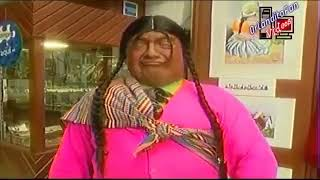

# The Concept of Internal Migration in Peru

The concept of internal migration refers to people moving from rural towns to urban cities, often in search of better opportunities and a different way of life—especially among children and young adults.

Several Peruvian authors, such as José María Arguedas, have written about internal migration and its consequences, including the loss of cultural identity, the struggle to adapt to urban life, and the effort to "fit in" within the city. One of his notable books, Los Ríos Profundos (Deep Rivers), portrays the experience of internal migration through the story of a child who moves from his rural town to a city. Another book, El Forastero (The Outsider), tells the story of a migrant who faces discrimination and exclusion in the urban setting.

More recently, a television show titled La Chola Jacinta depicted an Andean woman adapting to life in the city, highlighting—and often exaggerating—the differences between city dwellers and people from the Andes. It was a comedy show that used cultural stereotypes to generate laughs, often exaggerating traits of Andean people and making humor out of cultural clashes. If you search online, you’ll find that the show has been criticized for mocking Andean Peruvians ([BBC article](https://www.bbc.com/mundo/noticias-america-latina-42344708)).

However, if you watch the episodes, many also emphasize the honesty and integrity of Andean people—for instance, their values of not stealing, not harming others, and being loyal to those they love. Still, the show generalizes behaviors in ways that some find offensive (myself included), while others do not. It's important to remember that the show’s main goal was to entertain, not educate.

In my humble opinion, internal migration brings consequences such as racism and cultural conflict between city life and Andean traditions. Based on my experience, the ones who mistreat each other the most are Peruvians themselves. We tend to highlight our differences—whether we're from the Andes, the coast, or the jungle. Some people take pride in their origins without belittling others. Others, however, elevate their own traits and birthplace while demeaning those who are different. There are also people who simply accept their features and differences without assigning them positive or negative value—they try to see the good in everything. Finally, there are those with low self-esteem who find no value in their identity or traits and believe they are inherently inferior.

Fortunately, thanks to tourism, people are starting to find value in what once brought them shame. Young people who didn’t take pride in their traditions or customs are now beginning to appreciate them. When foreigners recognize the intrinsic value in aspects of the culture that locals overlook, it helps locals begin to see their own worth. In my experience, my hometown is starting to rediscover pride in its traditions and customs, and I increasingly see young people who feel proud of where they come from.